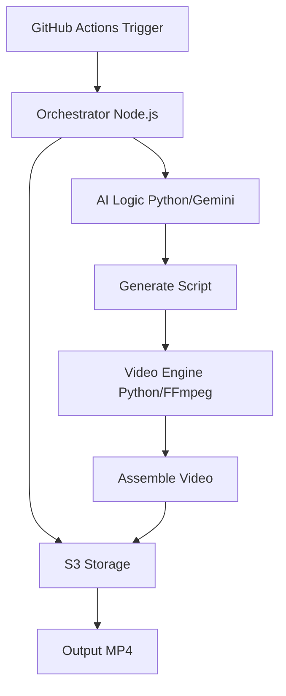

# 🎬 Auto-Short-Factory

> Automated video creation factory for TikTok, Instagram Reels, and YouTube Shorts powered by AI and FFmpeg

An intelligent monorepo built with **Turborepo** that automatically generates engaging vertical videos (9:16) using **Gemini 1.5 Flash AI** for script generation and **FFmpeg** for video assembly.

## 📋 Table of Contents

- [Features](#features)
- [Architecture](#architecture)
- [Tech Stack](#tech-stack)
- [Project Structure](#project-structure)
- [Getting Started](#getting-started)
- [Configuration](#configuration)
- [Development](#development)
- [Deployment](#deployment)
- [API Documentation](#api-documentation)

## ✨ Features

- 🤖 **AI-Powered Script Generation** - Gemini 1.5 Flash creates engaging video scripts
- 🎥 **Automated Video Assembly** - FFmpeg-based pipeline for professional video output
- 📱 **Platform-Optimized** - 9:16 vertical format for TikTok, Reels, and Shorts
- ☁️ **Cloud Storage** - AWS S3 integration for assets and outputs
- ⚡ **Turborepo** - Optimized monorepo with intelligent caching
- 🔄 **GitHub Actions** - Automated hourly video generation
- 📊 **TypeScript First** - Type-safe orchestration and configuration
- 🐍 **Python Services** - High-performance AI and video processing

## 🏗️ Architecture



## 🛠️ Tech Stack

### Core Technologies
- **Monorepo**: Turborepo + pnpm workspaces
- **Languages**: TypeScript (Node.js 18+), Python 3.11+
- **AI**: Google Gemini 1.5 Flash API
- **Video**: FFmpeg 6.0+ with hardware acceleration
- **Storage**: Amazon S3
- **CI/CD**: GitHub Actions (ubuntu-latest)

### Key Dependencies
- **Node.js**: `@aws-sdk/client-s3`, `axios`, `zod`
- **Python**: `google-generativeai`, `ffmpeg-python`, `fastapi`, `pydantic`

## 📁 Project Structure

```
auto-short-factory/
├── apps/
│   ├── orchestrator/          # Node.js/TypeScript - Workflow controller
│   │   ├── src/
│   │   │   ├── index.ts       # Main orchestrator
│   │   │   └── services/      # S3, AI, Video services
│   │   ├── package.json
│   │   └── tsconfig.json
│   │
│   ├── ai-logic/              # Python - Gemini AI integration
│   │   ├── src/
│   │   │   ├── main.py        # FastAPI service
│   │   │   ├── gemini_client.py
│   │   │   └── schemas.py     # Pydantic models
│   │   ├── requirements.txt
│   │   └── pyproject.toml
│   │
│   ├── video-engine/          # Python - FFmpeg video assembly
│   │   ├── src/
│   │   │   ├── main.py        # FastAPI service
│   │   │   └── video_assembler.py
│   │   ├── requirements.txt
│   │   └── pyproject.toml
│   │
│   ├── api/                   # NestJS API (existing)
│   └── web/                   # Next.js web (existing)
│
├── packages/
│   ├── config/                # Shared configuration
│   │   └── src/
│   │       ├── index.ts       # AWS, Gemini, video config
│   │       └── env.ts         # Environment validation
│   │
│   ├── types/                 # Shared TypeScript types
│   │   └── src/index.ts       # VideoScript, WorkflowState, etc.
│   │
│   ├── eslint-config/         # ESLint configurations
│   ├── typescript-config/     # TypeScript configurations
│   └── ui/                    # Shared UI components
│
├── .github/
│   └── workflows/
│       └── auto-video-factory.yml  # Hourly automation
│
├── turbo.json                 # Turborepo configuration
├── pnpm-workspace.yaml        # pnpm workspace config
└── package.json               # Root package
```

## 🚀 Getting Started

### Prerequisites

- **Node.js** 18+ and **pnpm** 8+
- **Python** 3.11+
- **FFmpeg** 6.0+
- **AWS Account** with S3 buckets
- **Google AI Studio** API key for Gemini

### 💻 Local Development (Web & API)

This section covers setting up the dashboard and public API for local development and testing.

1. **Clone the repository**
   ```bash
   git clone https://github.com/yourusername/auto-short-factory.git
   cd auto-short-factory
   ```

2. **Install dependencies**
   ```bash
   pnpm install
   ```

3. **Set up environment variables**
   ```bash
   cp .env.example .env.local
   ```
   Edit `.env.local` with your credentials.

4. **Start Web & API services**
   ```bash
   # Start both web and api in development mode
   pnpm run dev --filter web --filter api
   ```
   Access the dashboard at `http://localhost:3000`.

### 🐍 GitHub Actions Setup (Python Services)

The core video generation logic (Python services) is designed to run primarily on GitHub Actions for automated hourly processing.

#### 1. Configure GitHub Secrets
For the automated pipeline to work, configure these secrets in your repository settings:
- `GEMINI_API_KEY` - Your Gemini API key
- `AWS_ACCESS_KEY_ID` - AWS access key
- `AWS_SECRET_ACCESS_KEY` - AWS secret key
- `AWS_REGION` - AWS region
- `S3_BUCKET_ASSETS` - Assets bucket name

#### 2. Workflow Automation
The workflow [auto-video-factory.yml](.github/workflows/auto-video-factory.yml) handles:
- Setting up the Python environment (3.11).
- Installing FFmpeg for video rendering.
- Starting the **AI Logic** and **Video Engine** services.
- Triggering the **Orchestrator** to generate and upload the video.

#### 3. Local Testing of Python Services
If you need to test the Python services locally before pushing to GitHub:

```bash
# Terminal 1: AI Logic Service
cd apps/ai-logic
pnpm run dev

# Terminal 2: Video Engine Service
cd apps/video-engine
pnpm run dev

# Terminal 3: Run Orchestrator (requires local env setup)
cd apps/orchestrator
pnpm run dev
```

## 💻 Development

### Root Commands
From the root directory:

```bash
# Start Web and API only
pnpm run dev --filter web --filter api

# Build everything
pnpm run build

# Type check, lint, and format
pnpm run type-check
pnpm run lint
pnpm run format

# Run all tests
pnpm run test
```

### Individual Service Commands

**Orchestrator** (Node.js/TypeScript):
```bash
cd apps/orchestrator
pnpm run dev      # Development with watch mode
pnpm run build    # Compile TypeScript
pnpm run start    # Run production build
```

**AI Logic** (Python):
```bash
cd apps/ai-logic
pnpm run dev      # Start FastAPI with reload
pnpm run start    # Start production server
```

**Video Engine** (Python):
```bash
cd apps/video-engine
pnpm run dev      # Start FastAPI with reload
pnpm run start    # Start production server
```

## 🚢 Deployment

### GitHub Actions (Automated)

The workflow automatically runs hourly and generates videos:

1. Triggers on schedule (`0 * * * *`) or manual dispatch
2. Sets up Node.js, Python, and FFmpeg
3. Installs all dependencies
4. Starts AI Logic and Video Engine services
5. Runs orchestrator to generate video
6. Uploads video and script as artifacts
7. (Optional) Uploads to S3

### Manual Deployment

1. **Build for production**
   ```bash
   pnpm run build
   ```

2. **Deploy services** to your infrastructure
   - Orchestrator: Node.js server
   - AI Logic: Python/uvicorn service
   - Video Engine: Python/uvicorn service with FFmpeg

3. **Configure environment** variables for production

4. **Set up monitoring** and logging

## 📚 API Documentation

### AI Logic Service (Port 8001)

**Health Check**
```http
GET /health
```

**Generate Script**
```http
POST /generate-script
Content-Type: application/json

{
  "topic": "AI Trends 2026",
  "target_duration": 60,
  "target_platforms": ["tiktok", "instagram", "youtube"],
  "style": "entertaining"
}
```

### Video Engine Service (Port 8002)

**Health Check**
```http
GET /health
```

**Generate Video**
```http
POST /generate-video
Content-Type: application/json

{
  "script": { /* VideoScript object */ },
  "output_bucket": "auto-short-factory-output",
  "output_key": "videos/video_123.mp4"
}
```

### Interactive API Docs

- AI Logic: http://localhost:8001/docs
- Video Engine: http://localhost:8002/docs

## 🤝 Contributing

Contributions are welcome! Please follow these steps:

1. Fork the repository
2. Create a feature branch (`git checkout -b feature/amazing-feature`)
3. Commit your changes (`git commit -m 'Add amazing feature'`)
4. Push to the branch (`git push origin feature/amazing-feature`)
5. Open a Pull Request

## 📄 License

This project is licensed under the MIT License.

## 🙏 Acknowledgments

- **Turborepo** for monorepo tooling
- **Google Gemini** for AI capabilities
- **FFmpeg** for video processing
- **FastAPI** for Python services

---

**Built with ❤️ using Turborepo, TypeScript, Python, Gemini AI, and FFmpeg**
