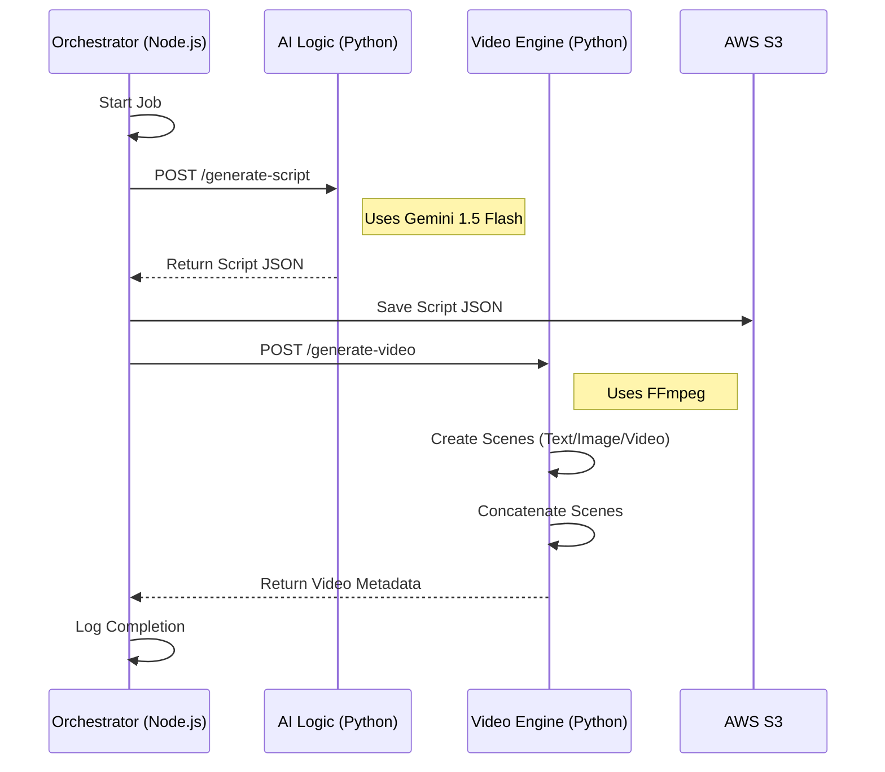

# 🛠️ Developer & Customization Guide

This guide is designed for developers who want to extend, customize, or contribute to the `auto-short-factory` project. It goes beyond the [README.md](./README.md) to explain the internal logic and how to modify it.

## 🏗️ Architecture Deep Dive

The project follows a linear pipeline architecture orchestrated by a Node.js service.



### Key Components

| Component | Path | Tech Stack | Role |
|-----------|------|------------|------|
| **Orchestrator** | `apps/orchestrator` | Node.js, TypeScript | Manages the workflow state, error handling, and service coordination. |
| **AI Logic** | `apps/ai-logic` | Python, FastAPI, Gemini | Generates the creative content (script, structure, captions) from a topic. |
| **Video Engine** | `apps/video-engine` | Python, FastAPI, FFmpeg | Performs the heavy lifting of video rendering and assembly. |

---

## 🤖 Customizing AI Logic

The "Brain" of the factory is the Gemini prompt. You likely want to change this to fit your brand or style.

### 1. Modifying the Prompt
**File:** `apps/ai-logic/src/gemini_client.py`
**Method:** `_build_prompt`

The prompt is currently hardcoded to produce a generic "entertaining" script.

```python
# apps/ai-logic/src/gemini_client.py

def _build_prompt(self, request: GeminiRequest) -> str:
    return f"""
    You are an expert video script writer...

    # CHANGE THIS SECTION to customize style
    Requirements:
    1. Create a hook in the first 3 seconds
    2. Use vertical format (9:16 aspect ratio)
    ...
    """
```

**Customization Ideas:**
-   **Change Persona:** "You are a serious financial analyst..."
-   **Change Structure:** Force specific scene types (e.g., "Always start with a question").
-   **Add Branding:** "Always end with 'Subscribe for more!'".

### 2. Updating the Data Model
**File:** `apps/ai-logic/src/schemas.py`

If you change the JSON structure returned by Gemini, you **must** update the Pydantic models here to match, or validation will fail.

---

## 🎥 Customizing Video Engine

The "Muscle" of the factory is the `VideoAssembler` class.

### 1. Changing Visual Style
**File:** `apps/video-engine/src/video_assembler.py`
**Method:** `_create_text_scene`

Currently, it creates a simple black background with white text.

```python
# apps/video-engine/src/video_assembler.py

def _create_text_scene(self, scene: Dict[str, Any], output: str):
    # CHANGE BACKGROUND COLOR
    img = Image.new('RGB', (self.width, self.height), color='#1a1a1a')

    # CHANGE FONT (Ensure the .ttf file is available in the container/path)
    # font = ImageFont.truetype("vibrant-font.ttf", 80)
```

### 2. Implementing Real Images/Videos
**File:** `apps/video-engine/src/video_assembler.py`

The current implementation uses **placeholders** for Image and Video scenes to keep the quickstart simple.

**To implement real media:**
1.  **Modify `_create_image_scene`**:
    *   Accept a URL in `scene['content']`.
    *   Use `requests` to download the image to `self.temp_dir`.
    *   Resize/Crop the image to 9:16 using `PIL` or `ffmpeg`.
2.  **Modify `_create_video_scene`**:
    *   Accept a URL.
    *   Download the video.
    *   Use `ffmpeg` to trim to `scene['duration']` and crop to 9:16.

### 3. Adding Captions
**Method:** `_add_captions`

Currently skipped. To implement, use the FFmpeg `drawtext` filter.

```python
# Example FFmpeg filter implementation
(
    ffmpeg
    .input(input_file)
    .filter('drawtext', text=caption_text, fontfile='arial.ttf', y='h-line_h-100', x='(w-text_w)/2')
    .output(output_file)
    .run()
)
```

---

## 🔌 Extending the Workflow

**File:** `apps/orchestrator/src/index.ts`
**Class:** `WorkflowOrchestrator`

The `executeWorkflow` method defines the steps.

### Adding a New Step (e.g., YouTube Upload)

1.  Create a new service: `apps/orchestrator/src/services/youtube.service.ts`.
2.  Add a new state to `packages/types/src/index.ts`: `WorkflowState.UPLOADING_TO_YOUTUBE`.
3.  Update the orchestrator:

```typescript
// apps/orchestrator/src/index.ts

// ... inside executeWorkflow ...

// Step 6: Upload to YouTube
job.state = WorkflowState.UPLOADING_TO_YOUTUBE;
await this.updateJob(job);

await this.youtubeService.upload(videoMetadata.outputUrl, {
    title: script.title,
    description: script.description
});
```

---

## 🐛 Debugging Tips

1.  **Check Temp Files:**
    The video engine creates a `temp/` folder. Checking the individual scene files (`scene_001.mp4`) is the best way to debug rendering issues.

2.  **Gemini Reponses:**
    The AI Logic service logs the raw script generated. Check the logs if the video structure looks wrong.

3.  **FFmpeg Logs:**
    In `video_assembler.py`, remove `quiet=True` from the `.run()` calls to see full FFmpeg output in your terminal.
