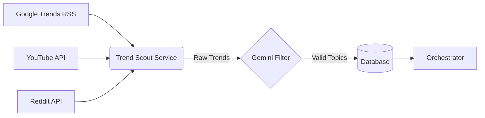

# 📉 Feature Plan: Auto Trend Finder ("Trend Scout")

## 🎯 Objective
Automate the discovery of viral video topics to ensure content is always relevant and timely. Instead of manually setting `VIDEO_TOPIC`, the system will scrape, filter, and queue trending topics automatically.

## 🏗️ Proposed Architecture

We will add a new service `apps/trend-scout` to the monorepo.



### 1. Data Sources (The "Sensors")

| Source | Method | Cost | Pros | Cons |
| :--- | :--- | :--- | :--- | :--- |
| **Google Trends** | RSS Feeds | Free | Real-time, localized | Broad topics only |
| **YouTube** | Data API (`mostPopular`) | Free (Quota) | Video-specific | High quota usage |
| **Reddit** | PRAW / .json | Free | Niche communities | Hard to parse noise |
| **NewsAPI** | API | Freemium | Timely news | Text-heavy |

### 2. Implementation Strategy

#### Step 1: Create `apps/trend-scout`
A lightweight Python service (shared logic with `ai-logic` for Gemini access).

**Core Logic:**
1.  **Fetch**: Download "Daily Search Trends" RSS from Google.
2.  **Filter**: Use Gemini to score relevance (0-10) and rewrite as a "Video Hook".
    *   *Input*: "Election Results 2026"
    *   *Prompt*: "Is this suitable for a fun fact channel? If yes, write a catchy title."
    *   *Output*: "5 Crazy Facts About the 2026 Election You Missed"
3.  **Push**: Insert approved topics into the `@repo/database` `Topic` table with `status = PENDING`.

#### Step 2: Database Updates
Update `packages/database/prisma/schema.prisma`:

```prisma
model Topic {
  id        String   @id @default(cuid())
  content   String   // The video topic/title
  source    String?  // e.g., "google_trends", "youtube"
  score     Int?     // Relevance score (0-10)
  status    String   @default("PENDING") // PENDING, USED, DISCARDED
  createdAt DateTime @default(now())
}
```

#### Step 3: Orchestrator Integration
Update `apps/orchestrator` to poll for `PENDING` topics instead of using a hardcoded environment variable.

### 3. Pipeline Configuration

**Schedule:**
Run as a separate GitHub Action cron job (`0 */6 * * *` - every 6 hours).

**Benefits:**
-   **Fully Autonomous**: No human input needed.
-   **High Relevance**: Content matches what people are searching for *right now*.
-   **Scalability**: Can add more "Sensors" (Twitter, TikTok) later.

## ⚠️ Challenges & Risks

1.  **Metric Stability**: Trends change hourly. A 6-hour old trend might be dead.
2.  **Brand Safety**: Automated scraping might pick up controversial/inappropriate topics.
    *   **Fix**: Rigorous "Safety Check" prompt in Gemini before saving to DB.
3.  **Quota Limits**: YouTube API is strict. Google Trends RSS is safer.

## 📋 Execution Checklist

- [ ] Initialize `apps/trend-scout` (Python).
- [ ] Implement Google Trends RSS parser.
- [ ] Implement Gemini "Filter & Rewrite" agent.
- [ ] Update Prisma Schema (`Topic` table).
- [ ] Create GitHub Action `trend-scout.yml`.
