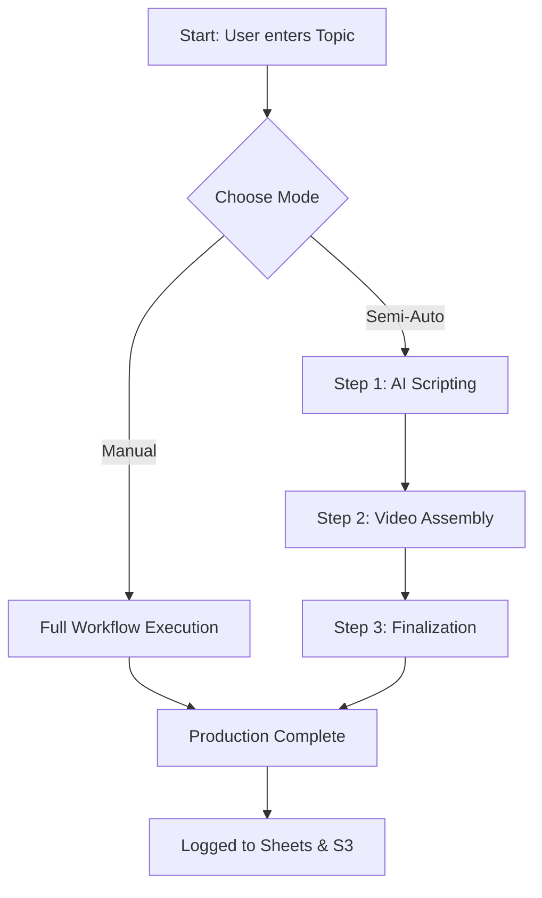

# 🏭 Video Factory Production Flow

This document details the architecture and workflow of the Video Factory feature in the Auto-Short-Factory project.

## 🚀 Overview

The Video Factory is a centralized system for generating short-form video content from a simple topic or keyword. It supports two distinct operating modes:
1.  **Manual Flow (Full Auto)**: A "one-click" experience that triggers the entire AI orchestration pipeline.
2.  **Semi-Auto Flow (Step-by-Step)**: A granular production environment where each stage (Scripting, Rendering, Finalization) is triggered manually, allowing for future human-in-the-loop interventions.

## 🏗️ Technical Architecture

The feature is implemented across three main layers of the monorepo:

### 1. Workflow Orchestrator (`@repo/orchestrator`)
The core logic resides in `WorkflowOrchestrator`. It has been refactored to expose individual production steps as public asynchronous methods:
- `generateScriptStep(job)`: Uses Gemini AI to write a high-retention script and saves it to S3.
- `assembleVideoStep(job, script)`: Communicates with the `video-engine` to render the final MP4.
- `finalizeWorkflowStep(job, videoMetadata)`: Logs the production data to Google Sheets and marks the job as `COMPLETED`.

### 2. Public API (`apps/api`)
The NestJS API acts as the bridge between the frontend and the orchestrator.
- **Service (`JobsService`)**: Manages the persistence of `WorkflowJob` states in the database and invokes orchestrator methods.
- **Controller (`JobsController`)**: Exposes the following REST endpoints:
    - `POST /jobs/generate`: Triggers the full manual flow.
    - `POST /jobs/step-script`: Triggers the first step (Script Generation).
    - `POST /jobs/:id/step-video`: Triggers the second step (Rendering).
    - `POST /jobs/:id/step-finalize`: Triggers the final step (Logging/Cleanup).

### 3. Dashboard (`apps/dashboard`)
A Next.js frontend providing a premium user interface for content creators.
- **Video Factory Page**: Located at `/dashboard/video-factory`.
- **Production Stepper**: A visual representation of the workflow state machine.
- **Proxy Layer**: Uses `apps/dashboard/proxy.ts` to securely relay requests to the backend API.

## 🔄 Workflow Lifecycle

### State Management
The system uses `WorkflowState` (from `@repo/types`) to track progress:
- `IDLE` -> `GENERATING_SCRIPT` -> `ASSEMBLING_VIDEO` -> `COMPLETED` / `FAILED`

## 📊 Monitoring & Logging
- **Database**: Every state change is persisted to the `VideoJob` table via Prisma.
- **Real-time**: State changes are emitted via `WorkflowOrchestrator.events` and exposed to the frontend via Server-Sent Events (SSE).
- **Google Sheets**: Final metadata (URL, duration, file size) is logged for business tracking.

---
*Created by Antigravity on 2026-01-22*
